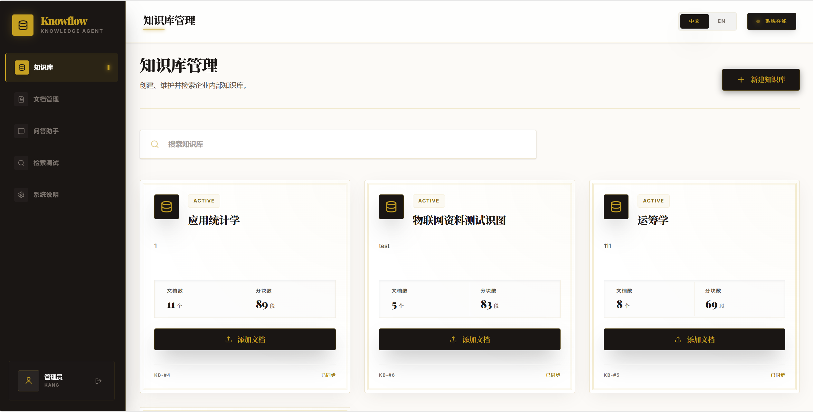
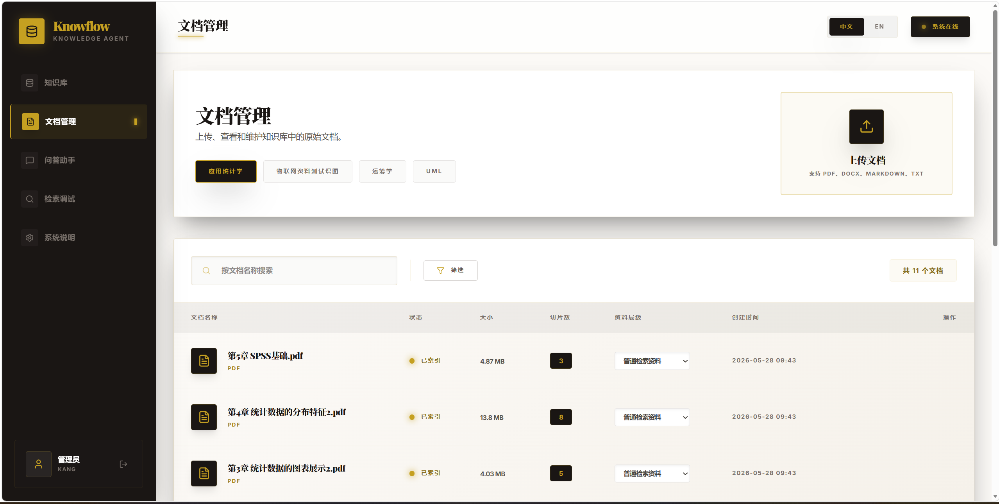
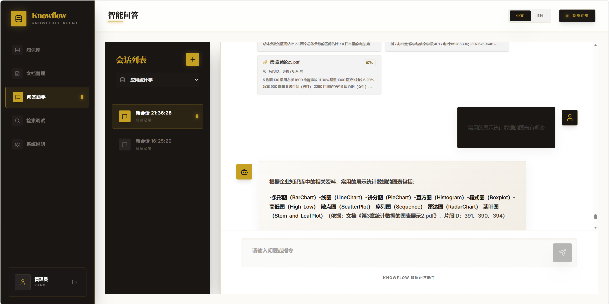

# Knowflow Agent Front

Knowflow Agent Front 是 Knowflow 知识库与问答系统的前端工程，提供知识库管理、文档管理、智能问答、检索调试和登录鉴权等页面。项目使用 React 单页应用作为前端主体，并通过本地 Express 服务承载开发环境、Mock API、真实后端代理和生产静态资源访问。

## 技术栈

- 核心框架：React 19、React DOM 19、TypeScript 5
- 构建工具：Vite 6、@vitejs/plugin-react
- 样式方案：Tailwind CSS 4、@tailwindcss/vite、@tailwindcss/typography
- 路由：React Router DOM 7
- 请求层：Axios，统一封装在 `src/api.ts`
- 动画：motion/react
- 图标：lucide-react
- Markdown 渲染：react-markdown
- 工具库：clsx、tailwind-merge、date-fns
- 本地服务：Express 4、tsx
- 生产打包：Vite 构建前端资源，esbuild 打包 `server.ts` 为 `dist/server.cjs`

## 目录说明

```text
.
├── src/                 # 前端源码
│   ├── pages/           # 页面模块
│   ├── config/          # 前端配置
│   ├── lib/             # 通用工具
│   ├── api.ts           # API 请求封装
│   ├── App.tsx          # 路由与应用布局
│   └── main.tsx         # React 应用入口
├── server.ts            # 本地开发服务、Mock API、真实后端代理、生产静态资源服务
├── vite.config.ts       # Vite 配置
├── tsconfig.json        # TypeScript 配置
├── package.json         # 依赖与脚本
└── .env.example         # 环境变量示例
```
- 知识库页面  可添加、修改知识库



- 点击添加文档可自动跳转至文档管理页面



- 问答界面可实现基于知识库的问答



## 环境要求

- Node.js 18 或更高版本，建议使用 Node.js 20/22 LTS
- npm

## 环境变量

先复制环境变量模板：

```bash
cp .env.example .env.local
```

Windows PowerShell 可使用：

```powershell
Copy-Item .env.example .env.local
```

常用配置项：

| 变量 | 说明 | 示例 |
| --- | --- | --- |
| `VITE_API_MODE` | API 模式，`real` 使用真实后端，`mock` 使用本地 Mock API | `real` |
| `VITE_API_BASE_URL` | 前端请求基础路径，通常保持同源 `/api` | `/api` |
| `BACKEND_API_URL` | 开发环境真实后端代理地址，仅 `real` 模式下由 `server.ts` 使用 | `http://localhost:8080/api` |
| `PORT` | 本地服务端口，默认 `3000` | `3000` |
| `GEMINI_API_KEY` | 如后续启用相关 AI 接口时使用；当前前端主流程不依赖该变量 | `your_api_key` |

## 安装依赖

```bash
npm install
```

## 本地开发流程

### 使用本地 Mock API

适合只调试前端页面与交互，不依赖后端服务的场景。

1. 修改 `.env.local`：

   ```env
   VITE_API_MODE=mock
   VITE_API_BASE_URL=/api
   ```

2. 启动开发服务：

   ```bash
   npm run dev
   ```

3. 浏览器访问：

   ```text
   http://localhost:3000
   ```

### 使用真实后端 API

适合联调后端接口的场景。

1. 确认后端服务已启动，例如：

   ```text
   http://localhost:8080/api
   ```

2. 修改 `.env.local`：

   ```env
   VITE_API_MODE=real
   VITE_API_BASE_URL=/api
   BACKEND_API_URL=http://localhost:8080/api
   ```

3. 启动前端开发服务：

   ```bash
   npm run dev
   ```

4. 浏览器访问：

   ```text
   http://localhost:3000
   ```

此模式下，前端请求 `/api`，本地 Express 服务会把请求代理到 `BACKEND_API_URL`。

## 常用脚本

```bash
npm run dev
```

启动本地 Express + Vite 开发服务。根据 `VITE_API_MODE` 决定启用 Mock API 或真实后端代理。

```bash
npm run lint
```

执行 TypeScript 类型检查，不输出构建产物。

```bash
npm run build
```

构建生产产物：先通过 Vite 生成前端静态资源，再通过 esbuild 将 `server.ts` 打包为 `dist/server.cjs`。

```bash
npm run start
```

启动生产构建后的服务，需先执行 `npm run build`。

```bash
npm run clean
```

清理构建产物。该命令使用 `rm -rf`，在 Windows 原生 PowerShell 中可能需要通过 Git Bash、WSL 或兼容 shell 执行。

## 生产运行流程

1. 安装依赖：

   ```bash
   npm install
   ```

2. 准备 `.env.local` 或运行环境变量。真实后端模式通常配置为：

   ```env
   VITE_API_MODE=real
   VITE_API_BASE_URL=/api
   BACKEND_API_URL=http://localhost:8080/api
   PORT=3000
   ```

3. 构建：

   ```bash
   npm run build
   ```

4. 启动：

   ```bash
   npm run start
   ```

5. 访问：

   ```text
   http://localhost:3000
   ```

生产模式下，`server.ts` 会托管 `dist` 目录中的静态资源，并继续按环境变量处理 `/api` 请求。

## API 模式说明

- `VITE_API_MODE=mock`：启用 `server.ts` 中注册的本地 Mock API，适合前端独立开发。
- `VITE_API_MODE=real` 且配置了 `BACKEND_API_URL`：本地服务将 `/api` 请求代理到真实后端。
- `VITE_API_MODE=real` 但未配置 `BACKEND_API_URL`：`/api` 请求需要由部署环境或外部网关提供。

## 开发入口

- 前端入口：`src/main.tsx`
- 应用路由与布局：`src/App.tsx`
- API 请求封装：`src/api.ts`
- API 基础配置：`src/config/api.ts`
- 本地服务入口：`server.ts`
